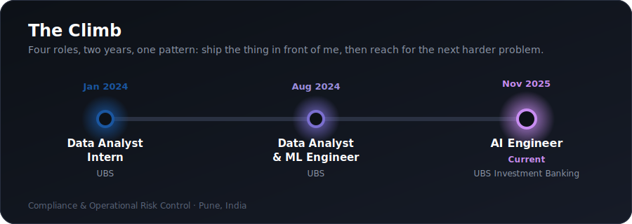

<!-- ============ HEADER BANNER ============ -->
<div align="center">
  
</div>

<!-- ============ TYPING ANIMATION ============ -->
<div align="center">
  <a href="https://github.com/shubh0614">
    
  </a>
</div>

<!-- ============ SOCIAL BADGES ============ -->
<div align="center">
  <a href="https://www.linkedin.com/in/shubhpathak0614/"></a>
  <a href="https://shubh0614.github.io/ShubhOS/"></a>
  <a href="mailto:shubhpathakpro@gmail.com"></a>
  
</div>

<br/>

<!-- ============ ABOUT ============ -->
## 🧠 About Me

```python
class ShubhPathak:
    def __init__(self):
        self.role     = "AI Engineer @ UBS Investment Banking"
        self.location = "Pune, India"
        self.focus    = ["GenAI", "Multi-Agent Systems", "RAG", "LLMOps"]
        self.building = "Production AI for regulated environments"
        self.mantra   = "Judgment over typing speed. Ship what runs."

    def current_work(self):
        return "A GenAI compliance platform processing 8,000+ docs/month"

    def off_the_clock(self):
        return "Tech Kahani - making ML accessible through story"
```

- 🏦 Building a generative AI compliance-review platform at UBS that cut a 6-person team's manual review workload by **85%**
- 🤖 I design agentic systems with **planner / sub-agent orchestration**, not chat demos
- 🧩 Comfortable across the whole stack: model layer, backend, frontend, and the database underneath
- 📖 On the side: **Tech Kahani**, a story-driven series that teaches ML to non-technical audiences
- 📫 Reach me at **shubhpathakpro@gmail.com**

<br/>

## 💼 Experience

<div align="center">
  
</div>

<!-- ============ FEATURED PROJECTS ============ -->
## 🚀 Featured Projects

<table>
<tr>
<td width="50%" valign="top">

### 🧬 Ada - AutoML Agent
A **9-agent LangGraph** platform that automates the full ML workflow, from data profiling to deployment, with self-correcting execution and auto-retry on failure. Usable three ways: a frontend UI, a GitLab ticket-driven flow, and a pip-installable package.

`Python` `LangGraph` `FastAPI` `React` `OpenAI`

[**→ View Repo**](https://github.com/shubh0614/ADA-MLFlow)

</td>
<td width="50%" valign="top">

### 📊 InvestIQ - AI Research Platform
An **agentic workspace** where an LLM plans and runs only the data tools a query needs, then returns a structured, sourced report. Tenant-scoped RAG on pgvector with database-tier row-level security.

`Next.js` `TypeScript` `Supabase` `pgvector` `Vercel`

[**→ Live Demo**](https://klypup-research.vercel.app/)

</td>
</tr>
<tr>
<td width="50%" valign="top">

### 🖥️ ShubhOS - Portfolio as an OS
My portfolio reimagined as a **browser-based operating system**: boot sequence, draggable windows, a live trainable neural network, a JD screener, and a working terminal.

`React` `TypeScript` `Canvas` `Tailwind`

[**→ Launch ShubhOS**](https://shubh0614.github.io/ShubhOS/)

</td>
<td width="50%" valign="top">

### 📖 Tech Kahani - ML Through Story
A story-driven tutorial universe (the "Office Café") that teaches machine learning to non-technical audiences through recurring characters and narrative. A give-back project.

`Storytelling` `ML Education` `GitHub Pages`

[**→ Coming Soon**](https://github.com/shubh0614)

</td>
</tr>
</table>

<br/>

<!-- ============ TECH STACK ============ -->
## 🛠️ Tech Stack

**AI / ML / GenAI**


**Backend / Full-Stack**


**Data / Cloud / Infra**


<br/>

<!-- ============ GITHUB STATS ============ -->
## 📈 GitHub Stats

<div align="center">
  
  
</div>

<div align="center">
  
</div>

<div align="center">
  
</div>

<br/>

<!-- ============ CERTIFICATIONS ============ -->
## 🎓 Certifications


<br/>

<!-- ============ FOOTER ============ -->
<div align="center">
  
</div>
